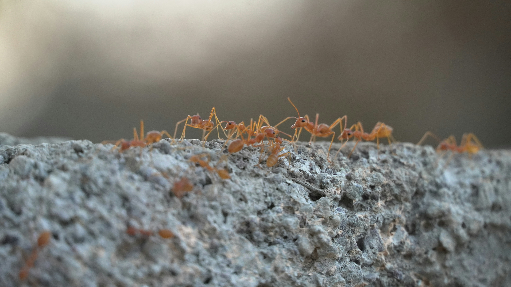
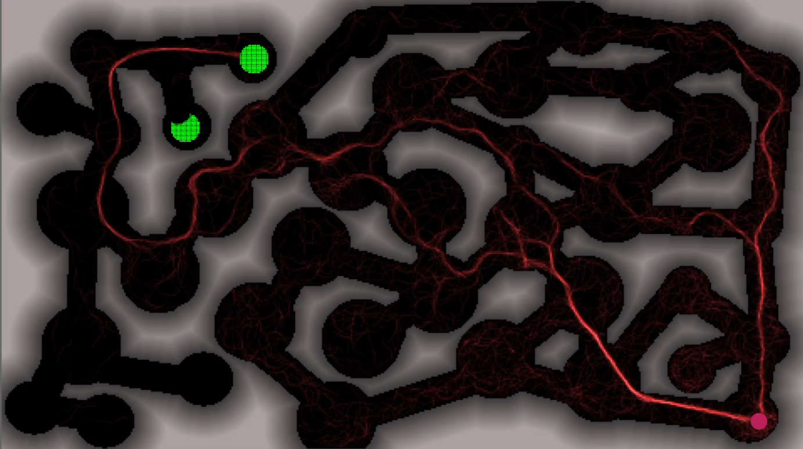
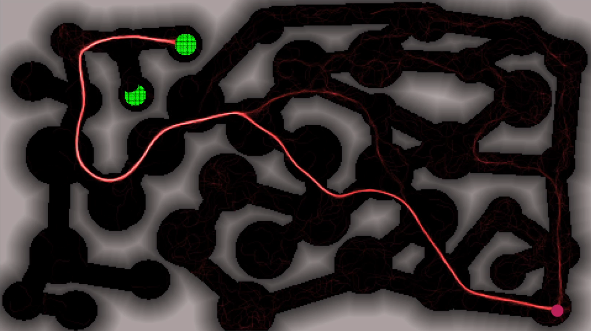
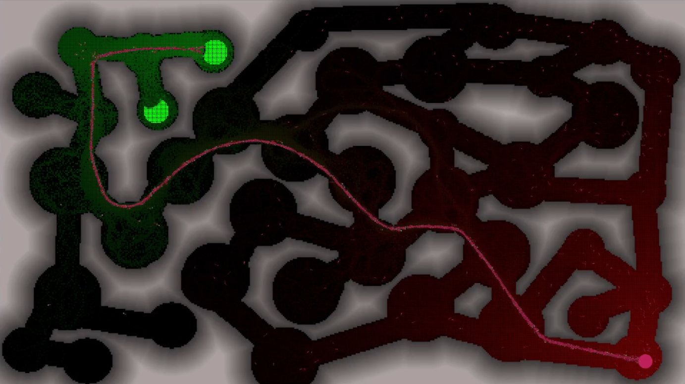

# Ant Colony Optimization

Ant Colony Optimization (ACO) is a meta-heuristic algorithm inspired by the foraging behavior of ant colonies in nature. Ants deposit pheromone trails while searching for food, and these trails influence other ants' path choices. Over time, shorter paths accumulate more pheromone, leading to the emergence of optimal routes.

## Natural Inspiration

In nature, ants initially explore randomly. When food is found, they return to the colony, laying down pheromone trails. Other ants are more likely to follow stronger pheromone trails, reinforcing successful paths. This collective behavior leads to the discovery of shortest paths between the nest and food sources.



## Algorithm Mechanics

ACO simulates this natural process through:

1. **Pheromone Trails**: Virtual pheromone levels on paths between nodes
2. **Heuristic Information**: Problem-specific information (like distances)
3. **Probabilistic Path Selection**: Ants choose paths based on both pheromone levels and heuristic information
4. **Pheromone Updates**: 
   - Local updates during solution construction
   - Global updates based on best solutions
   - Pheromone evaporation to prevent premature convergence

## Implementation

This repository includes an implementation of ACO for solving the Traveling Salesman Problem (TSP). The implementation is available in the `/Algorithm` directory and features:

- Configurable colony parameters
- Efficient matrix-based calculations
- Support for symmetric TSP instances
- Progress visualization
- Comprehensive documentation

For detailed implementation information, please see the [Algorithm README](./Algorithm/README.md).

## Visualization

The following images are from [AntSimulator](https://github.com/CS-Astronaut/AntSimulator), a forked project used to visualize how ants naturally find optimal paths using pheromone trails.

| AntSimulator |
|----------------------------|
|  |
|  |
|  |
## Further Reading

For more detailed information about ACO, you can refer to the following resources:

1. [Ant Colony Optimization - A Tutorial Review](./src/AntColonyOptimization-ATutorialReview.pdf)
2. Dorigo, M., & Stützle, T. (2004). Ant Colony Optimization. MIT Press.
3. Dorigo, M., Maniezzo, V., & Colorni, A. (1996). Ant system: optimization by a colony of cooperating agents.

## Applications

ACO has been successfully applied to various optimization problems:

- Traveling Salesman Problem (TSP)
- Vehicle Routing
- Network Routing
- Job Shop Scheduling
- Graph Coloring
- Feature Selection

## Directory Structure

```
Ant Colony Optimization/
├── Algorithm/          # Implementation of ACO for TSP
|    └──README.md       # how the algorithm works    
├── src/                # Resources and documentation
└── README.md          
```
