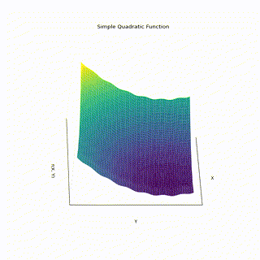
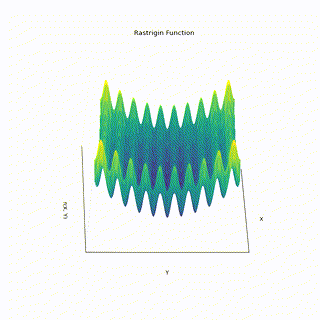
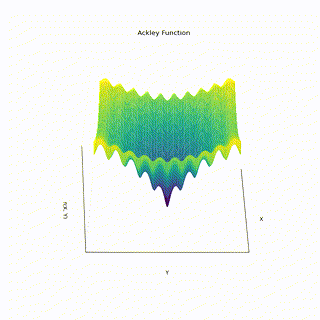

# Particle Swarm Optimization (PSO) Visualizations and Explanation

## Introduction to Particle Swarm Optimization (PSO)

Particle Swarm Optimization (PSO) is a fascinating computational method used to solve optimization problems. Imagine you are trying to find the lowest point in a valley while blindfolded. You are with a group of friends, and each of you is searching. At each step, you not only move based on your own best location found so far but also get a hint from the friend who has found the overall best location in the group.

This is the core idea behind PSO. It's a population-based technique where a 'swarm' of potential solutions (called 'particles') explore the search space. Each particle's movement is influenced by its best-known position (personal best, `pbest`) and the best position known by the entire swarm (global best, `gbest`).

The particles iteratively update their velocity and position using these guiding principles:

$v_{i}(t+1) = w \cdot v_i(t) + c_1 \cdot r_1 \cdot (pbest_i(t) - x_i(t)) + c_2 \cdot r_2 \cdot (gbest(t) - x_i(t))$

$x_i(t+1) = x_i(t) + v_i(t+1)$

*   $v_i(t)$: Velocity of particle $i$ at iteration $t$.
*   $x_i(t)$: Position of particle $i$ at iteration $t$.
*   $w$: Inertia weight (controls momentum).
*   $c_1, c_2$: Cognitive and social coefficients (how much particles are influenced by personal best and global best).
*   $r_1, r_2$: Random numbers (introduce stochasticity).
*   $pbest_i(t)$: Best position found by particle $i$ so far.
*   $gbest(t)$: Best position found by any particle in the swarm so far.

This collaborative search process allows the swarm to efficiently explore complex landscapes and converge towards optimal solutions.

## Visualizing PSO on Different Functions

The following table shows the optimization process of the PSO algorithm on various mathematical test functions. Each row displays the contour plot of the function alongside the PSO animation, showing the particles converging towards a minimum.

| Function                        | Function Contour and PSO Animation                      |
|---------------------------------|---------------------------------------------------------|
| **Simple Quadratic Function**   | <table><tr><td></td><td></td></tr></table> |
| **Rastrigin Function**          | <table><tr><td></td><td></td></tr></table>             |
| **Ackley Function**             | <table><tr><td></td><td></td></tr></table>                 |
| **Himmelblau Function**         | <table><tr><td></td><td></td></tr></table>             |

*Note: The 'Function Contour' image on the left uses the same animation GIF as the 'PSO Animation' on the right for illustration purposes, as separate static contour plots were not provided. The animations themselves show the contour lines.*

This visualization helps understand how PSO navigates the function landscape, especially in the presence of multiple local minima.

