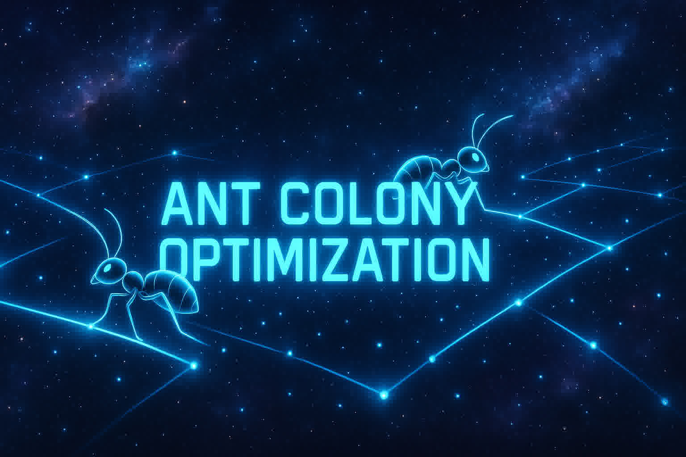
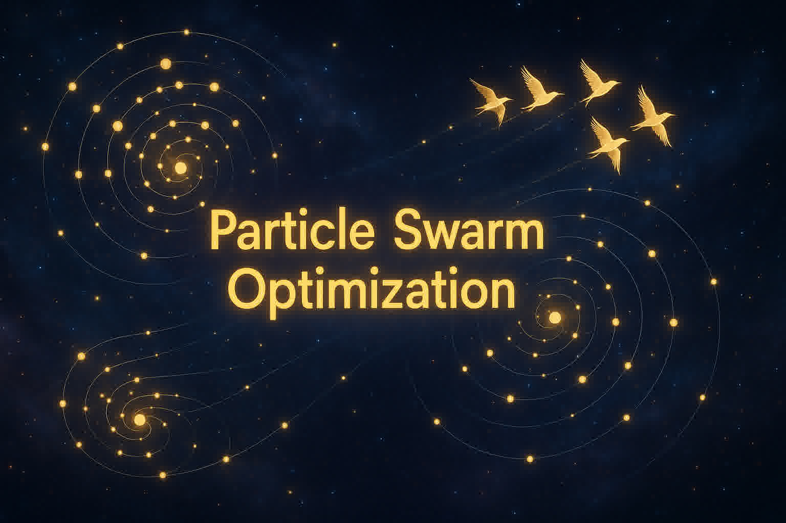
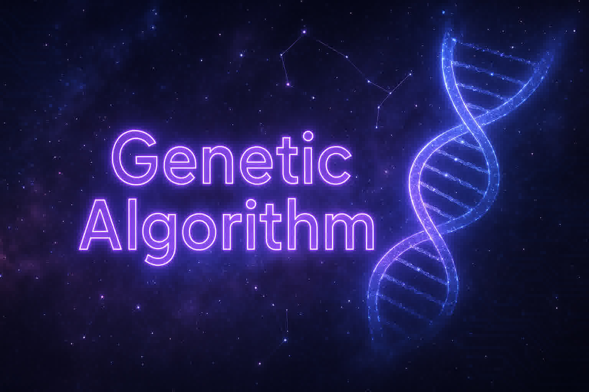

# Meta‑Heuristic‑Algos

Meta‑Heuristic Algorithms Implementations with Comprehensive Documentation

  

## Introduction

Meta‑heuristics are optimization methods inspired by natural processes, from biological evolution to collective animal behavior. designed to explore complex search spaces efficiently when traditional approaches fail.

## [Ant Colony Optimization (ACO)](https://github.com/CS-Astronaut/Meta-Heuristic-Algos/tree/main/Ant%20Colony%20Optimization):
Mimics how ants deposit and follow pheromone trails to collectively discover shortest paths.

## [Particle Swarm Optimization (PSO)](https://github.com/CS-Astronaut/Meta-Heuristic-Algos/tree/main/Particle%20Swarm%20Optimization):
Models the social behavior of birds flocking or fish schooling, where particles share information to converge on optimal solutions.

## [Genetic Algorithm (GA)](https://github.com/CS-Astronaut/Meta-Heuristic-Algos/tree/main/Genetic%20Algorithm):
Inspired by Darwinian evolution, using selection, crossover, and mutation to evolve populations toward fitter solutions.

